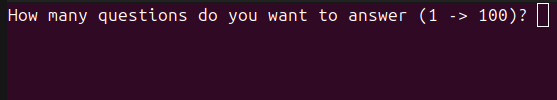
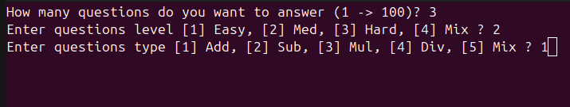
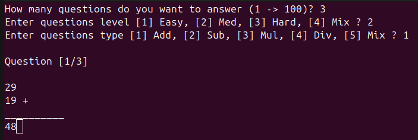
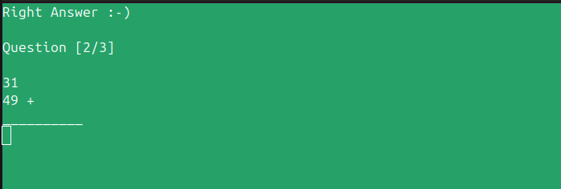
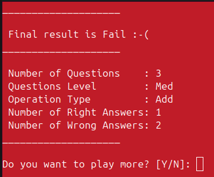

# Math Console Game
Is an arithmetic game for the famous 4 arithmetic operations (+, -, x, /).  
It built with C++ programming language, and on Linux OS.

## Description
**Math Console Game** provide you up to 100 question in each round, that can categorized in 4 levels of hardness, and even you can categorized them based arithmatic operation.

This game generate questions randomly with a smart system, not from fixed Questions Bank. So it has a larage number of possible questions.

## Installing and Running: (Linux OS)

### Installing
1. Take a clone of the project in your PC:  
You can just copy the following command and past it in your terminal.
    ```
    git clone git@github.com:Ahmed101Mohammed/math-game.git
    ```
2. Go to the project source code using your terminal:  
The project source code will be located at ```src``` folder.

### Running
1. Run the ```build``` output:  
Open the terminal and route to the ```build``` folder and then run the following
command:
    ```
    ./a.out
    ```

## How to play :-)
When the project run you will see this beautiful screen:  
  

Then you can choose the number of questions you want to answer. 
I will choose 3 for example.  

Then you will have 2 more question, as you can see them and my answers.  
  

Then you can see the first question, and asnwer it. As you can see the question 
and my answer.
  

Then you get the result of your answer, and the next question.  
  

After you answered all question, you get your final result.  
  

And as you can see, that the game ask you if you want to play again or not? 
Have you given up?  

##### Let's Play :-)